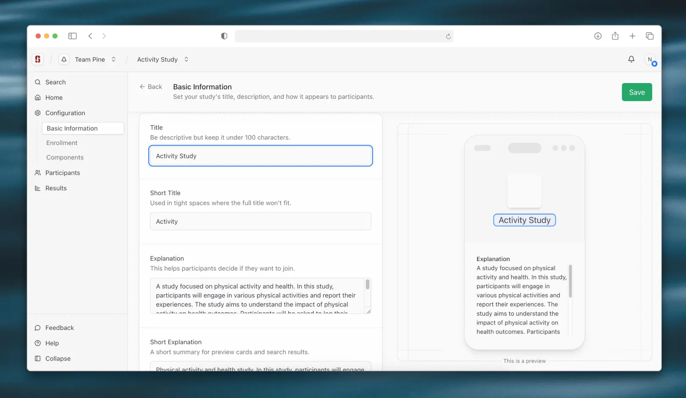

<!--

This source file is part of the Stanford Biodesign Digital Health Spezi Web Study Platform open-source project

SPDX-FileCopyrightText: 2025 Stanford University and the project authors (see CONTRIBUTORS.md)

SPDX-License-Identifier: MIT

-->

# Stanford Biodesign Digital Health Spezi Web Study Platform Frontend

[](https://github.com/StanfordSpezi/spezi-web-study-platform/actions/workflows/build-and-test.yml)

The project aims to build an open‑source platform that enables researchers to run simple studies without deep technical expertise. Users define studies by specifying metadata, participant criteria, and app components. These study definitions then configure the companion iOS and Android apps that participants use to take part in the study. Get a quick overview of the platform by checking out the [screenshots](docs/reference/screenshots.md).

This repository contains the frontend code for the platform. Visit [spezi-web-service-study-platform](https://github.com/StanfordSpezi/spezi-web-service-study-platform) for the backend code.



## Getting Started

To get started with the project, follow these steps:

1. Clone the repository:
   ```bash
   git clone https://github.com/StanfordSpezi/spezi-web-study-platform.git
   cd spezi-web-study-platform
   ```
2. Install the dependencies:
   ```bash
   npm install
   ```
3. Create a `.env` file:
   ```bash
   cp .env.example .env
   ```
4. Start the development servers:
   ```bash
   npm run dev
   ```

For more detailed instructions, check out the [installation guide](docs/guides/installation.md).

## Explanations

- [About the tech stack](docs/explanations/tech-stack.md)
- [About deployments](docs/explanations/deployment.md)
- [About styling and visual grammar](docs/explanations/styling.md)
- [About the integration with the spezi web design system components](docs/explanations/design-system-components.md)
- [About the development server](docs/explanations/development-server.md)

## Tutorials

- [Run and explore the development server](docs/tutorials/development-server.md)

## Guides

- [Install and run the project locally](docs/guides/installation.md)
- [Run the E2E tests locally](docs/guides/e2e-testing-local.md)
- [Add a new API endpoint](docs/guides/add-api-endpoint.md)

## Reference

- [App screenshots](docs/reference/screenshots.md)
- [Color tokens reference](docs/reference/color-tokens.md)

## Contributing

We welcome contributions! Please read our [contributing guidelines](https://github.com/StanfordSpezi/.github/blob/main/CONTRIBUTING.md) for more information on how to get started.

## License

This project is licensed under the MIT License. See [Licenses](https://github.com/StanfordSpezi/spezi-web-study-platform/tree/main/LICENSES) for more information.

## Contributors

This project is developed as part of the Stanford Byers Center for Biodesign at Stanford University.
See [CONTRIBUTORS.md](https://github.com/StanfordSpezi/spezi-web-study-platform/tree/main/CONTRIBUTORS.md) for a full list of all contributors.


