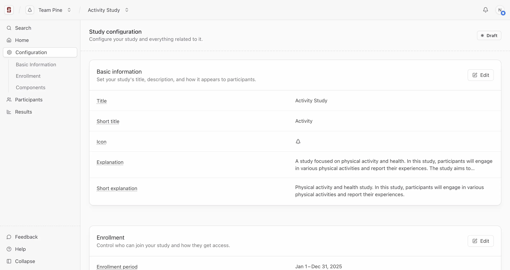

<!--

This source file is part of the Stanford Biodesign Digital Health Spezi Web Study Platform open-source project

SPDX-FileCopyrightText: 2025 Stanford University and the project authors (see CONTRIBUTORS.md)

SPDX-License-Identifier: MIT

-->

# App screenshots

This document provides a collection of screenshots showcasing various parts of the Spezi Web Study Platform frontend. These images illustrate the user interface and key features of the application.

## Sign in

## Create team

## Invite team members

## Create the first study

## Dashboard

## Study configuration

### Basic information

### Enrollment

### App components

#### Component types

#### Component schedule

